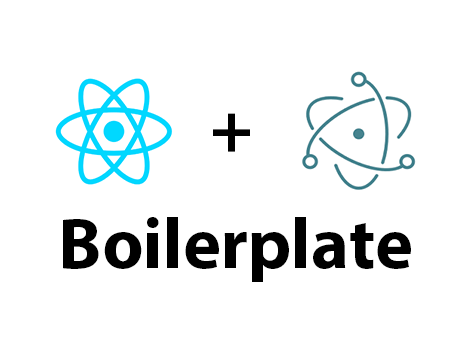

<p>
  Simple Electron and React Boilerplate uses <a href="https://electron.atom.io/">Electron</a>, <a href="https://facebook.github.io/react/">React</a>, <a href="https://github.com/reactjs/react-router">React Router</a>, <a href="https://webpack.github.io/docs/">Webpack</a>,<a href="https://github.com/enzymejs/enzyme">Enzyme</a>,<a href="https://jestjs.io/">Jest</a> and <a href='https://github.com/yan-foto/electron-reload'>Electron reload</a> for fast desktop application development
</p>

# Simple Electron + React Boilerplate

<br/><br/>
<div align="center">
  <a href="https://facebook.github.io/react/"></a>
  <a href="https://webpack.github.io/"></a>
  <a href="https://github.com/ReactTraining/react-router"></a>
  <a href="https://facebook.github.io/jest/"></a>
</div>

<hr />
<br />

<div align="center">
I made this boilerplate because i found it very diffcult to setup an Electron project with React when i first wanted to this. I also didn't like the way most boilerplates were set up. This is a really simple and minimal Electron + React boilerplate to get you started with a project. This project use a Webpack as a module bundler to React ES2015 to vanilla JS. HAPPY CODING!!!

## Overview
All components are located in src folder.

## To get started
  * Make sure you have node installed 
  * Clone or download repository
      ```
            git clone https://github.com/asadadams/simple-electron-react-boilerplate.git
      ```
  * Copy the contents of node_modules into a different directory
  * Install packages
      ```
        npm install    
      ```
      
## Usage
To start development 

* Run webpack 
      ```
            npm run dev
      ```

* Start project
      ```
            npm run start
      ``` 
* Run tests
       ```
            npm run test
      ``` 

## To do 
- Add Redux

## Developers
If you are a developer feel free to contribute to the project by providing bug fixes, new ideas and suggestions.  
*NB: This was also written out of boredom and i needed a boilerplate to start with whenever i'm starting a new project.*

## Me
Want to say hi? Will be happy to hear from you
* [Twitter](http:///www.twitter.com/asadadams)
* [Facebbok](http://www.facebook.com/asad.adams)
* [Instagram](http://www.instagram.com/asadadams)
* [Mail](clarkpeace.adams@gmail.com)